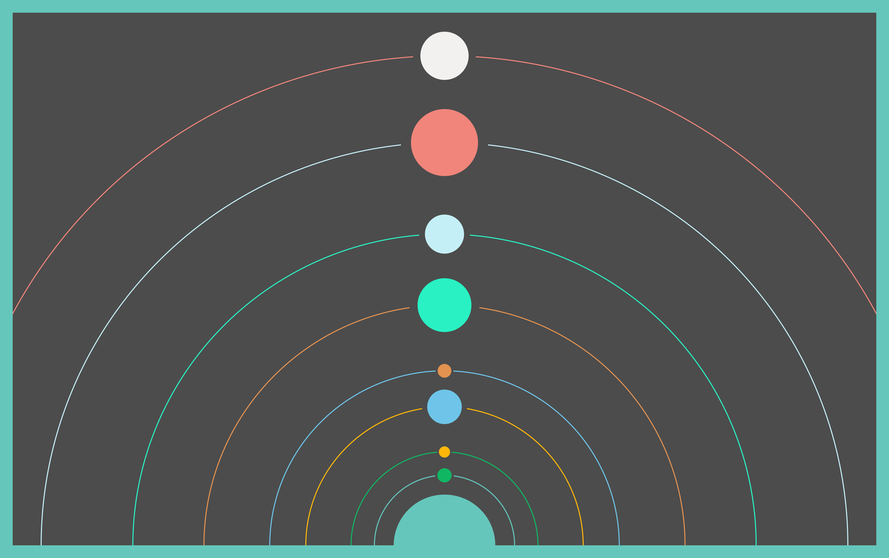
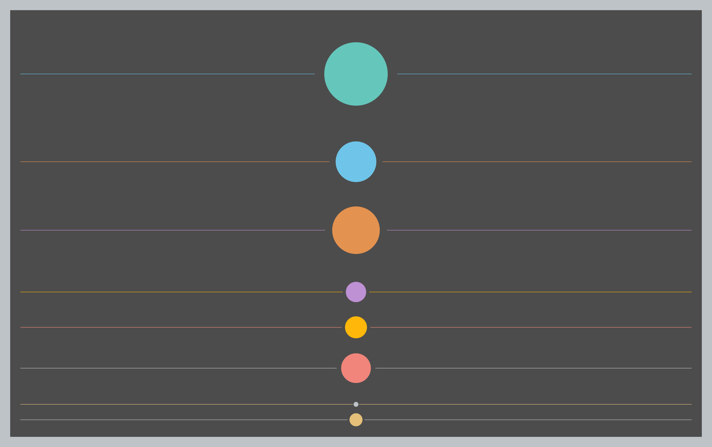

# Generative Solar System

### About

I've been studying a lot, recently, about generative arts using python. My goal is to move towards machine learning models using GAN's or other technologies. However, as a first step, I decided to create a random generator for solar systems.

Basically, this python project generates several models of solar systems with or without the sun, with straight or curved orbits and with several different colors.

### Tools

* Pycharm 2021.1.2 (Pofessional Edition)
* Python 3.9.2
* Pillow 9.1.1
* Pycairo 1.21.0

### How to run

* First of all, you need python3. [Click Here](https://www.python.org), download and install it.
* Open your terminal and clone this repository:

  `````bash
  git clone https://github.com/felipolis/Generative-Solar-System.git
  `````
* Move to the project directory:

  ````bash
  cd Generative-Solar-System
  ````
* Install all the dependencies:

  ````bash
  pip install requirements.txt
  ````
* Now we have to run the program, using the following parameters:


  | Param | Definition |
  | - | - |
  | --width | Specify Width |
  | --height | Specify Height |
  | -o or --orbit | Curve Orbit |
  | -l or --line | Straight Orbit |
  | -s or --sunsize | Specify the Sun Size |
  | -bs | Specify the Border Size |
  | -n or --noise | Specify the Noise |


  ````bash
  python main.py --width 3500 --height 2200 -o -s 200 -bs 50 -n .8
  ````

**Obs1.** Note that you can change the parameter values however you want.

**Obs2.** Note that you must choose whether to use the parameter -o (--orbit) to generate curved orbits or -l (--line) to generate straight orbits. It is not possible to use both parameters together.

**Obs3.** Note that if you don't want the sun to appear, just set the -s (--sunsize) to 0.

**Obs4.** Don't forget to check your artwork in the Examples directory. This is where all of them will be saved.

### Examples

````bash
python main.py --width 3500 --height 2200 -o -s 200 -bs 50 -n .8
````




````bash
python main.py --width 3500 --height 2200 -l -s 200 -bs 50 -n .8
````




**Obs5.** Note that the program will always generate two versions of the artwork: one without texture and one with texture.

### References

[Python](https://docs.python.org/3/)

[Pillow](https://pillow.readthedocs.io/en/stable/)

[PyCairo](https://pycairo.readthedocs.io/en/latest/)

[erdavids](https://github.com/erdavids/Generative-Space-System)

***Made by Felipe Archanjo.***
